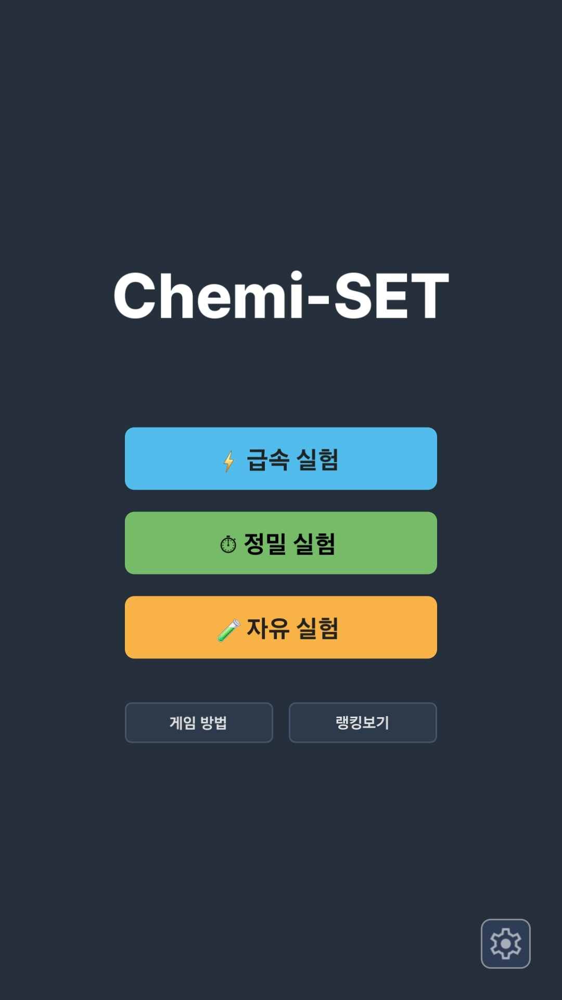
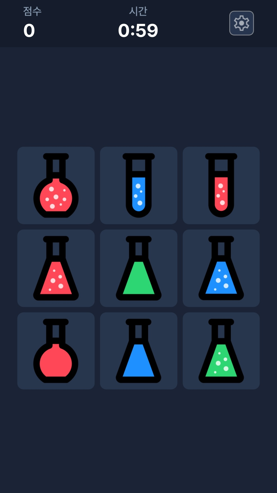
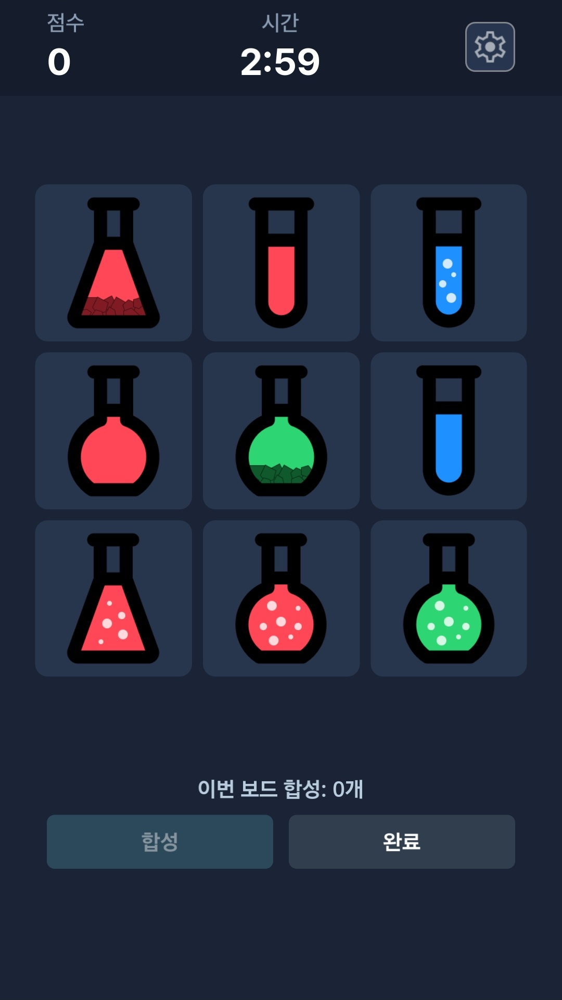
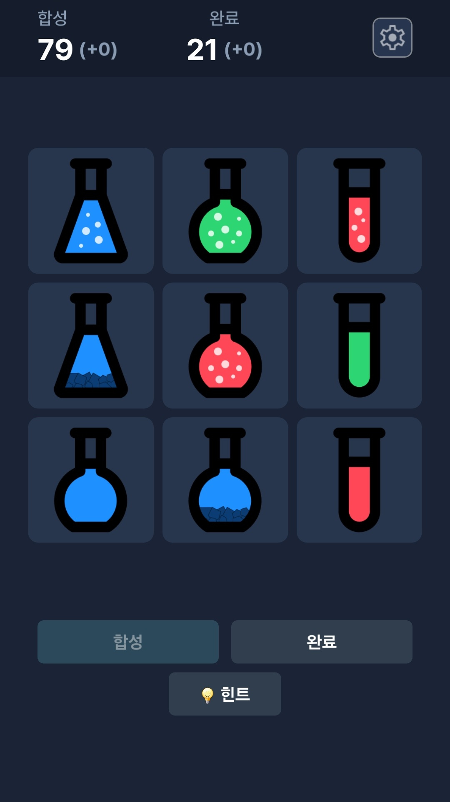
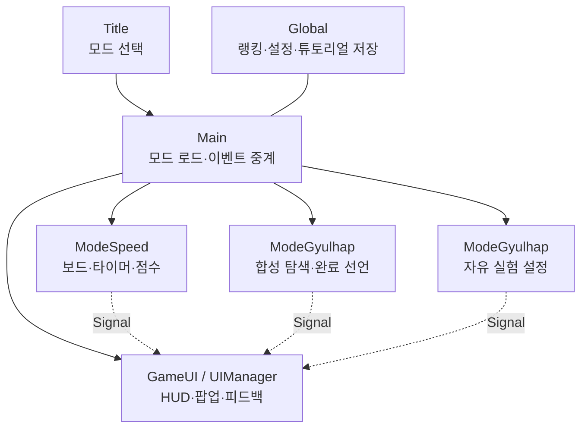

# CHEMI-SET — 익숙한 조합 퍼즐을 화학 실험으로 재해석한 모바일 프로토타입

> 개발 기간: 2026년  
> 역할: 기획 · 구현 · UI/UX · 플레이테스트  
> 엔진: Godot 4

## 프로젝트 개요

CHEMI-SET은 3×3 보드의 실험 카드 가운데 세 장을 골라, 조합 조건을 만족하는지 판단하는 모바일 퍼즐 프로토타입이다. 카드에는 모양, 색상, 내용물 상태라는 세 가지 속성이 있으며, 세 카드의 각 속성이 **모두 같거나 모두 다를 때** 합성이 성립한다.

이 프로젝트의 출발점은 상업적 출시보다 혼자 기획부터 구현, 테스트, 개선, Android 출시 빌드 제작까지 한 사이클을 완주하는 경험이었다.

## 한눈에 보기

> **한 줄 소개** — 조합 퍼즐 규칙을 화학 실험 콘셉트로 재해석한 3×3 모바일 퍼즐 게임

- **핵심 경험:** 1분 속도전, 3분 완전 탐색, 무한 학습 모드로 같은 규칙에 다른 판단 경험을 설계
- **기획 검증:** JSONL 로그 898건을 바탕으로 남은 합성 수별 해결 시간을 분석하고 급속 실험 점수 구간을 조정
- **개발 범위:** Godot 4로 UI·게임 규칙·저장 데이터를 분리하고 Android AAB 빌드까지 완료

| 타이틀과 모드 선택 | 급속 실험: 1분 속도전 |
|---|---|
|  |  |
| 정밀 실험: 모든 합성을 찾고 완료 선언 | 자유 실험: 힌트 기반 학습 |
|  |  |

## 기획의 출발점: 조합 퍼즐을 화학 실험으로 재해석하기

프로젝트는 기존의 조합 퍼즐과 ‘모든 조합을 찾은 뒤 완료를 선언하는’ 게임 흐름에서 출발했다. 단순한 재현으로 보이지 않도록, 카드 조합이 성립하는 과정을 **세 약품이 안정적으로 합성되는지 판단하는 실험**으로 해석했다.

모양·색상·내용물 상태를 비교하는 카드 디자인, ‘합성’과 ‘완료’라는 용어, 급속·정밀·자유 실험이라는 모드 명칭을 통해 하나의 화학 실험 콘셉트로 묶고자 했다.

초기에는 화면의 빈 공간에 약품이 섞이거나, 잘못된 조합에서 폭발하는 애니메이션도 고려했다. 그러나 급속 실험에서는 판정 뒤 바로 다음 카드를 관찰해야 하므로, 큰 연출이 카드 인식과 속도감을 방해할 수 있다고 판단했다. 이번 버전에서는 화려한 장면 전환보다 카드·점수·판정 피드백의 가독성과 반응 속도를 우선했다.

## 한 가지 규칙에서 두 가지 판단 경험으로

처음에는 모든 합성을 찾고 완료를 선언하는 정밀 실험만 구현하려 했다. 실제로 플레이해 보니 완료를 선언하는 판단은 생각보다 난도가 높았고, 합성을 빠르게 찾아내는 경험과는 다른 종류의 긴장감을 만들었다.

그래서 한 규칙을 두 모드로 분리했다. 결과적으로 급속 실험은 즉각적인 관찰과 속도 경쟁을, 정밀 실험은 보드 전체를 검증하며 신중하게 완료를 선언하는 경험을 맡게 됐다.

### ⚡ 급속 실험

- 제한 시간 1분 안에 최대한 많은 합성을 찾는 점수 경쟁 모드
- 빠르게 답을 찾고 다음 보드로 넘어가는 리듬을 핵심으로 설계
- 남은 합성 수에 따라 EXCELLENT, GREAT, GOOD 피드백과 점수를 차등 적용
- 콤보 보너스와 오답 감점으로 속도와 정확성 사이의 긴장감 형성

숙련자인 개발자에게는 짧고 빠르게 반복하기 좋은 모드였지만, 일부 플레이어에게는 규칙을 충분히 익히기 전 1분의 시간 압박 자체가 높은 진입 장벽으로 작용할 수 있음을 확인했다.

### ⏱ 정밀 실험

- 제한 시간 3분 안에 한 보드의 모든 합성을 찾고 완료를 선언하는 모드
- 합성을 성공해도 카드를 즉시 바꾸지 않고 보드를 유지
- 플레이어가 “정말 모든 합성을 찾았는가?”를 검증하도록 설계

단순히 시간이 긴 급속 실험이 아니라, 보드 전체를 의심하고 확인하는 판단 자체가 핵심 재미가 되도록 구성했다.

### 🧪 자유 실험

- 시간과 점수 부담 없이 규칙을 학습하는 무한 모드
- 힌트와 누적 합성·완료 기록 제공
- 힌트를 쓴 보드에서는 완료 누적 기록을 얻지 못하게 하여 직접 해결의 가치를 유지

### 힌트는 정답 공개가 아니라 탐색 범위를 줄이는 장치

자유 실험의 힌트는 정답 카드 세 장을 바로 보여주지 않고, 아직 찾지 못한 합성에 포함된 카드 한 장만 표시한다. 처음에는 정보가 부족해 보일 수 있지만, 한 장을 기준점으로 잡으면 플레이어는 남은 카드들을 하나씩 비교하며 나머지 두 장을 찾을 수 있다. 즉 9장 전체에서 세 장을 막연히 고르는 탐색을, 특정 카드와 연결되는 조합을 검토하는 탐색으로 바꾼다.

이 방식은 규칙을 아직 완전히 익히지 못한 플레이어에게도 해결 경로를 제공하면서, 최종 속성 비교와 합성 판단은 직접 수행하게 한다. 힌트를 사용한 합성은 누적 합성 기록에서 제외하고, 힌트를 사용한 보드에서는 완료 기록을 얻지 못하게 해 힌트가 정답 공개 버튼이 아니라 학습을 위한 보조 도구로 기능하도록 설계했다.

이 과정에서 발견한 점은 힌트의 난도가 “얼마나 많은 정보를 보여줄 것인가”보다 “언제 도움을 사용할지와 기록을 어떻게 교환하게 할 것인가”에서 더 크게 발생한다는 것이었다. 따라서 자유 실험은 단순한 쉬운 모드가 아니라, 자력 해결과 학습 도움 사이의 선택을 제공하는 모드가 되었다.

## 플레이 로그를 활용한 점수 설계

개발 과정에서 가장 흥미로웠던 부분은 난도와 보상을 감으로 결정하지 않고, 실제 플레이 로그를 바탕으로 점수를 조정한 과정이었다.

### 기록 방식

급속 실험의 각 보드와 합성 시도에 다음 정보를 JSONL 로그로 남겼다.

- 보드의 합성 수와 카드 구성
- 합성 시도 당시의 남은 합성 수
- 성공·오답 여부, 정답까지 걸린 보드 경과 시간
- 기본 점수, 콤보 보너스, 오답 감점, 누적 점수
- 합성 속성 유형과 세션 최종 점수

### 표본과 한계

일반 플레이 로그에는 급속 실험 **83세션**, 합성 시도 **898건**이 남아 있다. 이 중 성공은 854건, 오답은 44건으로 성공률은 약 95.1%였다. 단, 이 데이터는 탐색 방식에 익숙한 개발자 개인의 기록이 중심이므로 전체 플레이어의 난도를 대표하지 않는다. 따라서 수치를 절대적인 밸런스 정답이 아니라 1차 설계 가설을 세우는 기준선으로 사용했다.

### 남은 합성 수와 해결 시간

점수 개편 이후의 v2~v4 정상 성공 기록 551건을 현재 보상 구간에 맞춰 묶어 비교했다. 합성이 적게 남을수록 해결 시간이 길어지는 경향이 나타났다.

| 합성 시도 전 남은 합성 수 | 표본 수 | 중앙 해결 시간 | 평균 해결 시간 | 최종 기본 점수 |
|---|---:|---:|---:|---:|
| 1개 | 30 | 7.07초 | 10.05초 | 300점 |
| 2개 | 83 | 4.59초 | 6.85초 | 180점 |
| 3~4개 | 348 | 3.09초 | 4.30초 | 100점 |
| 5개 이상 | 90 | 2.54초 | 3.49초 | 75점 |

풀이 시간의 평균과 중앙값 모두에서 `1개 > 2개 > 3~4개 > 5개 이상` 순으로 보상 효율이 내려가도록 기본 점수를 300·180·100·75점으로 조정했다. 답이 적은 보드일수록 한 번의 성공을 크게 보상하고, 합성이 많은 보드에서는 빠른 연속 성공과 콤보가 보상을 만들도록 한 것이다. 현재 규칙에서는 오답에 75점을 감점하고 콤보를 초기화한다.

| 합성 시도 전 남은 합성 수 | 기본 점수 | 평균 해결 시간 기준 | 중앙 해결 시간 기준 |
|---|---:|---:|---:|
| 1개 | 300점 | 29.9점/초 | 42.4점/초 |
| 2개 | 180점 | 26.3점/초 | 39.2점/초 |
| 3~4개 | 100점 | 23.3점/초 | 32.4점/초 |
| 5개 이상 | 75점 | 21.5점/초 | 29.5점/초 |

위 비교는 점수 자체가 풀이 시간에 정확히 비례하도록 만든 공식이 아니라, 적은 답을 찾았을 때의 보상 가치를 유지하면서도 2개 구간이 1개 구간보다 더 효율적인 역전 현상을 피하기 위한 검증 기준으로 사용했다.

### 기본 점수와 콤보의 역할

급속 실험의 보상은 단순히 한 합성을 맞힐 때마다 같은 점수를 주는 구조가 아니다. 보드에 남은 합성 수에 따른 기본 점수와 연속 성공에 따른 콤보 보너스가 서로 다른 플레이를 보상하도록 역할을 나눴다.

| 점수 요소 | 보상하려는 플레이 | 설계 의도 |
|---|---|---|
| 기본 점수 | 답이 적은 상황에서 한 합성을 찾아내는 판단 | 희소한 답을 오래 탐색한 성공이 손해로 느껴지지 않게 함 |
| 콤보 보너스 | 답이 많은 흐름에서 빠르고 정확하게 연속 성공하는 실행 | 급속 실험의 속도감과 흐름을 유지하는 재미를 강화 |
| 오답 감점·콤보 초기화 | 무작정 선택하지 않고 정확하게 판단하는 플레이 | 빠른 입력에 긴장감을 부여하고 무작위 선택을 억제 |

답이 많은 보드는 빠르게 연속 성공하고 콤보를 만들 기회가 많고, 답이 적은 보드는 한 번의 성공 자체가 더 큰 가치를 갖는다. 두 보상 축을 함께 둠으로써 어느 한쪽의 보드만 유리해지지 않도록 의도했다.

다만 위 시간 기록은 개발자 한 명의 숙련된 플레이에 크게 의존한다. 다른 플레이어가 같은 구간을 얼마나 어렵게 느끼는지, 특히 1분 모드의 진입 장벽과 오답 빈도가 어떤지는 아직 충분히 검증하지 못했다. 이후 여러 숙련도의 플레이어를 대상으로 같은 로그를 수집해 점수 구간과 감점·콤보 규칙을 다시 검토할 필요가 있다.

### 합성 유형별 관찰

카드가 중복되지 않는 덱에서는 세 속성이 모두 같은 조합이 나올 수 없으므로, 실제 합성 유형은 7가지다. 점수 개편 이후 v2~v4의 정상 성공 기록 551건을 속성별 같음·다름 조합으로 분류해 풀이 시간을 비교했다.

| 모양 | 색상 | 내용물 상태 | 표본 수 | 중앙 해결 시간 | 평균 해결 시간 |
|---|---|---|---:|---:|---:|
| 다름 | 다름 | 다름 | 51 | 10.08초 | 11.43초 |
| 다름 | 다름 | 같음 | 31 | 7.72초 | 8.62초 |
| 같음 | 다름 | 다름 | 88 | 4.67초 | 6.23초 |
| 다름 | 같음 | 다름 | 140 | 3.41초 | 4.29초 |
| 같음 | 다름 | 같음 | 65 | 3.22초 | 4.23초 |
| 다름 | 같음 | 같음 | 85 | 2.08초 | 2.48초 |
| 같음 | 같음 | 다름 | 91 | 1.73초 | 2.15초 |

세 속성이 모두 다른 유형과, 모양·색상은 모두 다르며 내용물 상태만 같은 유형이 특히 오래 걸렸다. 반대로 모양·색상이 같고 내용물 상태만 다른 유형은 가장 빠르게 찾는 경향을 보였다.

이는 특정 합성 유형이 개발자에게 더 어려울 가능성을 보여주는 관찰값이다. 다만 개인 기록 중심의 표본이므로 최종 점수에 유형별 보너스를 바로 적용하지는 않았다. 외부 플레이어 기록을 추가로 수집한 뒤 적용 여부를 판단하는 것이 더 적절하다고 보았다.

이 과정은 단순히 수치를 정하는 일이 아니라, 플레이어가 어떤 보드를 어렵게 느끼고 어떤 상황에서 보상을 납득하는지 가설을 세우고 검증하는 기획 작업이었다.

## 플레이테스트를 통해 개선한 점

### 첫 진입에서 규칙 이해가 어려움

초기 안내는 카드 세 장을 선택하라는 설명에 치우쳐 있어, 플레이어가 ‘합성’의 의미 자체를 이해하기 어려웠다. 가능한 조합과 불가능한 조합 예시를 추가하고, 속성 비교 결과를 직접 확인하는 체험형 튜토리얼을 만들었다.

### 개발자 숙련도만으로 난도를 판단하기 어려움

개발자는 일정한 탐색 알고리즘을 익힌 상태였기 때문에, 일반 플레이어와 체감 난도가 다를 수 있었다. 특히 급속 실험에서 일부 플레이어가 규칙 이해 이전에 시간 압박을 크게 느낄 수 있음을 확인했다. 이후에는 입문 난도 보드, 단계형 속도, 또는 자유 실험에서 급속 실험으로 이어지는 전환 설계를 검토할 필요가 있다.

## 구현 구조

- `main`은 모드 로드와 UI 이벤트 중계만 담당
- 각 모드 씬은 보드·점수·타이머 등 세션 상태를 독립적으로 관리
- 모드는 Signal로 UI에 상태를 전달하여, UI와 규칙 로직이 직접 얽히지 않도록 구성
- 랭킹, 설정, 튜토리얼 완료 여부는 로컬 저장 데이터로 분리

## 결과와 회고

게임 규칙 설계뿐 아니라 플레이 로그 기반의 점수 조정, 모드별 목표 차별화, 튜토리얼 UX 개선, 효과음·진동 적용, Android AAB 빌드 및 Play Console 등록 준비까지 경험했다.

정식 출시는 개인 개발자 계정의 비공개 테스트 요건 때문에 보류했지만, 시작 목표였던 ‘혼자 하나의 게임 개발 사이클을 끝까지 완주하기’는 달성했다.

## 다음 개선 방향

- 여러 플레이어 데이터에 기반한 보드 난이도 프로필 고도화
- 영어 현지화 및 외부 사용자 테스트
- 게임 종료 후 플레이 리포트와 재도전 목표 강화
- 정식 출시를 위한 비공개 테스트 운영
